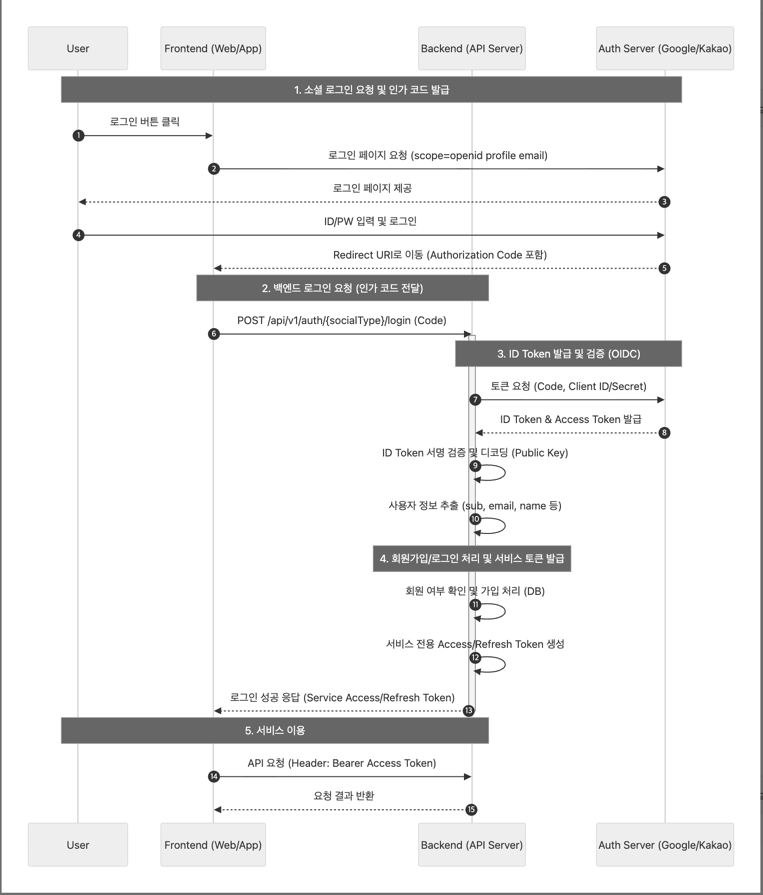
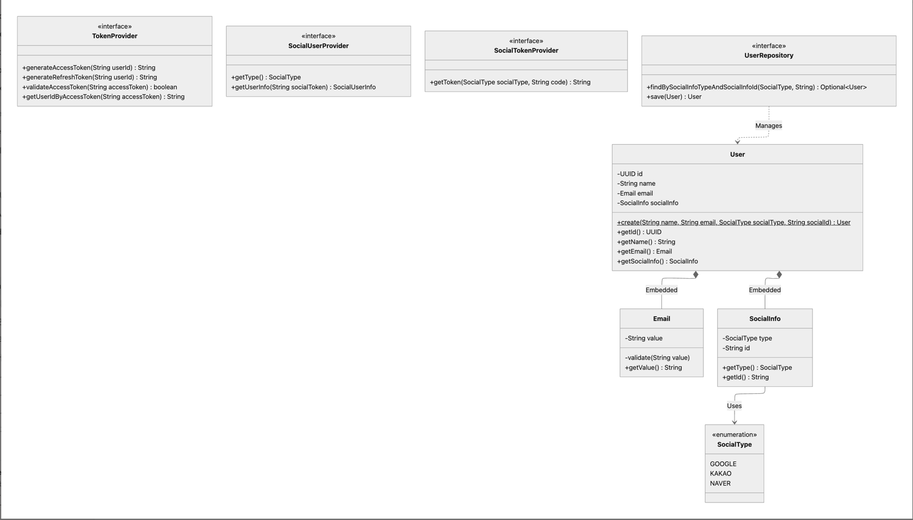
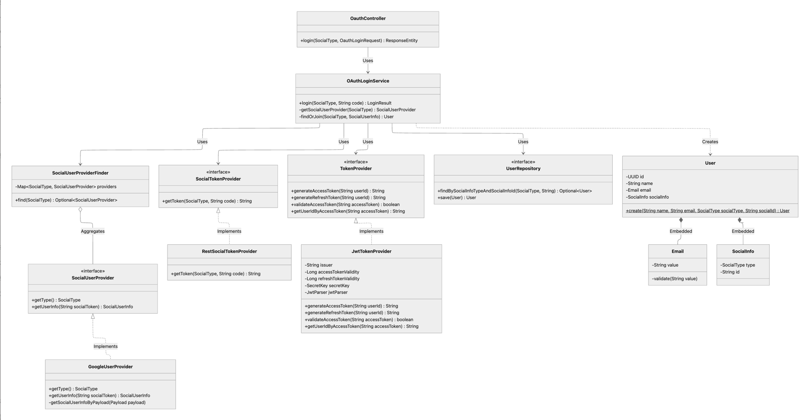

# OAuth 2.0 소셜 로그인 설계 및 구현

## 1. 개요
- "유저는 구글, 카카오 계정을 연동하여 가입/로그인이 가능하다." 요구사항을 위한 기능 구현
- OAuth 2.0 + Token 인증 방식을 사용하여 사용자 편의성 및 서버 확장성 제공

## 2. 흐름 및 클래스 설계
### 2.1 OAuth 2.0 가입/로그인 흐름
**Authorization Code Flow**
1. Frontend 에서 소셜 로그인 후 리다이렉트에 포함된 Code 를 받아 Backend 로 요청
2. Backend 에서 받은 Code 를 소셜 인증 서버에서 REST API 형식으로 ID Token 과 교환
3. 각 소셜 서버에서 제공하는 공개 키로 ID Token 검증 및 사용자 정보 추출
4. 자체 토큰 (Access Token, Refresh Token) 발급

### 2.2 도메인 클래스 설계
- User 도메인 클래스 설계
- 로그인/가입에 필요한 Provider, Repository 인터페이스 설계 

### 2.3 구현 클래스 설계
- 구현 클래스 설계

## 3. 구현

### 3.1 소셜 유저 제공자 (Strategy Pattern)
- 다양한 소셜 로그인(Google, Kakao, Naver 등)을 지원하기 위해 **전략 패턴(Strategy Pattern)** 을 적용
- `SocialUserProvider` 인터페이스를 정의하고, 각 소셜 타입별 구현체(`GoogleUserProvider`)를 구현하여 소셜 로그인을 추가할 때 기존 코드를 수정하지 않고 확장할 수 있는 구조

### 3.2 OIDC 인증 방식 구현
- 별도의 Resource API 호출 없이 ID Token 검증 및 사용자 정보를 조회하여 네트워크 비용 절감
- 소셜 인증 서버에서 ID Token 을 발급 받아 소셜에서 제공해준 공개키(`GoogleIdTokenVerifier`) 로 검증
- 유저 정보를 추출하여 로그인 및 가입 로직 구현

### 3.3 JWT 기반 토큰 구현
JWT 라이브러리를 사용하여 인증 토큰 발급 및 검증
- `TokenProvider` -> `JwtTokenProvider` 토큰 발급 및 검증 로직 구현
- 런타임 시 `JwtAuthenticationFilter` -> `JwtTokenProvider` 의존하여 토큰 정보 검증 
